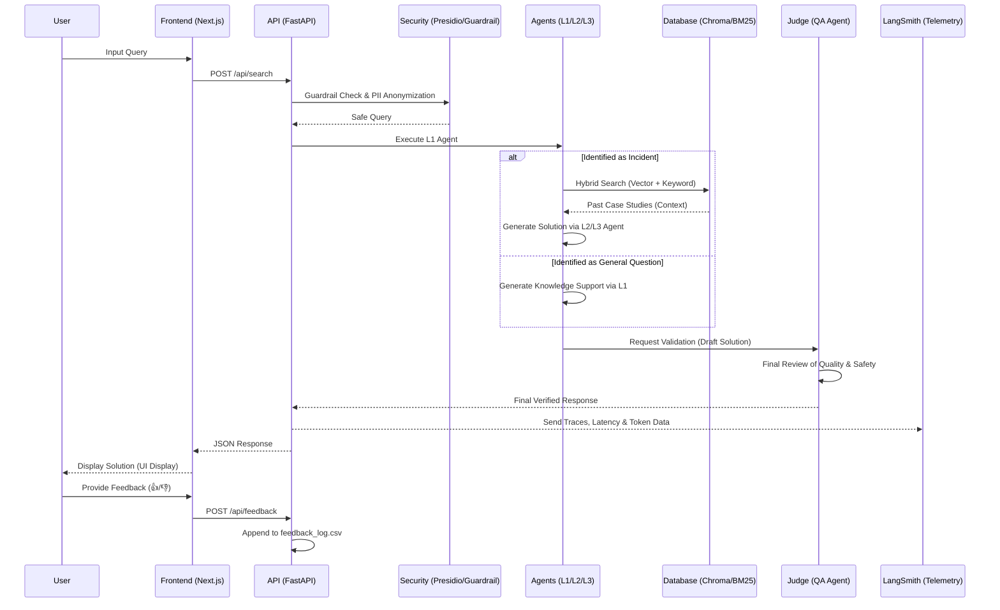
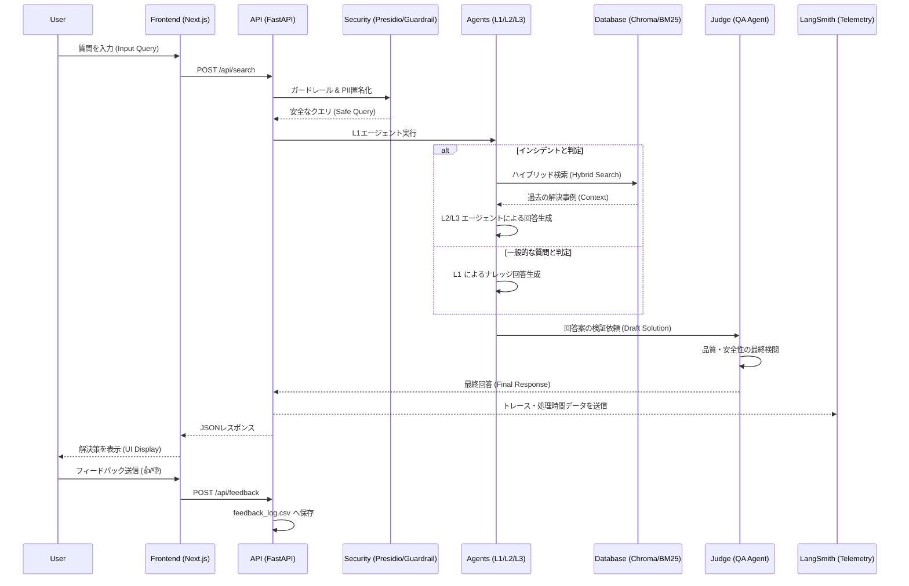

# Data Flow Documentation (English)
## English Version

## System Data Flow (Sequence Diagram)
This diagram illustrates the flow of data from the moment a user inputs a query until the final resolution is returned.



## Key Processing Steps

### 1. Pre-processing (Security & Privacy)
- **Guardrail**: The LLM scans the input to block malicious instructions, such as prompt injections.
- **PII Masking**: Microsoft Presidio detects sensitive information (names, IP addresses, etc.) and anonymizes it before the data reaches the AI models.

### 2. Multi-tier Routing
- **L1 (Triage)**: Classifies the query as either an "Incident" or a "General Question."
- **L2 (Incident)**: Derives solutions from past cases and assigns the issue to the correct team (Network, DB, Storage, etc.).
- **L3 (Security)**: Triggered when a critical threat is detected to provide specialized security instructions.

### 3. Hybrid RAG Engine
- **ChromaDB**: Utilizes vector search to find past cases with similar semantic meanings.
- **BM25**: Utilizes keyword search to ensure accuracy for specific terms like error codes.
- **RRF & Reranking**: Merges search results and scores them based on recency and past success rates.

### 4. Post-processing (Quality Assurance)
- **LLM-as-a-Judge**: A dedicated QA agent verifies that the output follows the required format and ensures there are no hallucinations, refining the final response for the user.
```


## 日本語版 (Japanese Version)

# Data Flow Documentation

## System Data Flow (Sequence Diagram)
ユーザーが質問を入力してから、最終的な解決策が返却されるまでのデータの流れを記述します。



## Key Processing Steps

### 1. Pre-processing (Security & Privacy)
- **Guardrail**: LLMが入力内容をスキャンし、不適切な指示（プロンプトインジェクション等）をブロックします。
- **PII Masking**: Microsoft Presidioが氏名やIPアドレスなどの個人情報を検出し、AIへ渡す前に匿名化します。

### 2. Multi-tier Routing
- **L1 (Triage)**: 問い合わせが「インシデント（障害）」か「一般質問」かを分類します。
- **L2 (Incident)**: 過去の事例から解決策を導き出し、適切な担当チーム（Network/DB等）を判定します。
- **L3 (Security)**: 重大な脅威が疑われる場合、セキュリティ専門の指示を生成します。

### 3. Hybrid RAG Engine
- **ChromaDB**: ベクトル検索により、意味の近い過去事例を抽出します。
- **BM25**: キーワード検索により、エラーコードなどの完全一致を補完します。
- **RRF & Reranking**: 両方の検索結果を融合し、鮮度と成功率に基づいてスコアリングを行います。

### 4. Post-processing (Quality Assurance)
- **LLM-as-a-Judge**: 生成された回答がフォーマットを遵守しているか、誤情報（ハルシネーション）がないかを検証し、最終的な出力を調整します。
```