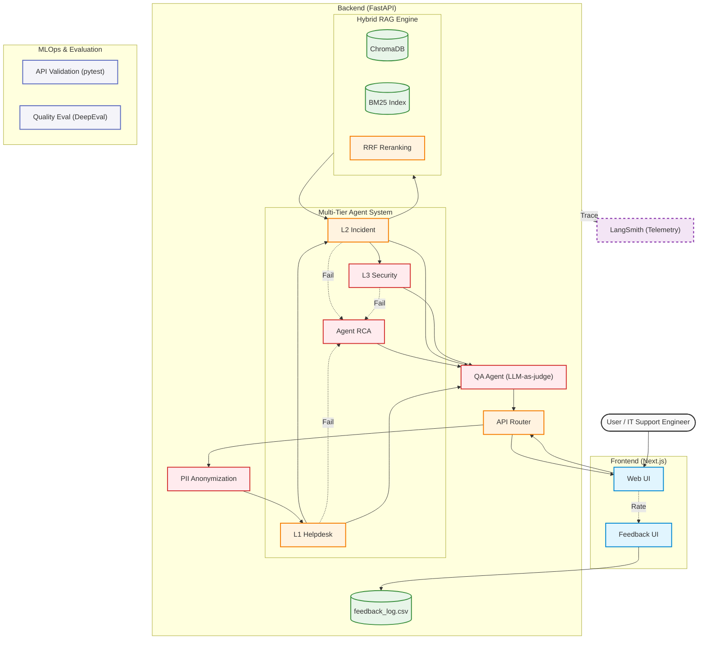

## English Version

# AI-Powered Incident Knowledge Base Assistant

## Overview
This is an AI-driven incident resolution assistant that automates triage operations and knowledge retrieval for IT support teams. 
When a user inputs a troubleshooting issue in natural language, the system autonomously searches past incident data for the best solution, determines the priority, and routes the issue to the appropriate team.

## Architecture


## Key Features
- **Multi-Tier Agent System (L1 → L2 → L3 Handoff)**
  - Multiple specialized agents work together instead of a single AI. L1 (Triage) determines if the query is a general question or an incident. L2 (Incident) provides solutions and routing based on past cases. If a security threat is detected, the issue is automatically escalated to L3 (Security).
- **Hybrid Search & Reranking**
  - Implements the RRF algorithm combining ChromaDB (Vector search) and BM25 (Keyword search) to extract the most accurate solutions.
- **Robust Data Privacy & Guardrails**
  - Integrates Microsoft Presidio to automatically mask PII (Personally Identifiable Information) before sending data to the AI. Includes input validation to block inappropriate queries.
- **Quality Assurance & Feedback Loop**
  - **LLM-as-a-Judge**: A QA agent checks the format and safety of the generated response before showing it to the user.
  - **Feedback System**: Collects user ratings (👍/👎) into a CSV file for continuous improvement.
  - **Agent RCA**: If an agent fails to process a request, it performs a Root Cause Analysis and reports the error to the UI.
- **Telemetry & MLOps**
  - **LangSmith**: Fully visualizes trace, latency, and token consumption for every API call.
  - **DeepEval & Pytest**: Automated evaluation of hallucination using a golden dataset, and automated API endpoint testing.

## Tech Stack
- **Frontend**: Next.js, React, Tailwind CSS
- **Backend**: FastAPI, Python
- **AI / LLM**: OpenAI (gpt-4o-mini, text-embedding-3-small), LangChain
- **Database / Search**: ChromaDB, rank_bm25
- **Privacy**: Microsoft Presidio
- **MLOps & Testing**: LangSmith, DeepEval, pytest
- **Infrastructure**: Docker, Docker Compose

## Project Setup (How to run)

### Prerequisites
- Docker and Docker Compose installed (Mac recommended)
- OpenAI API Key
- LangSmith API Key (for Telemetry)

### Installation Steps

1. Create a `.env` file in the project root directory and add the following:
    ```env
    OPENAI_API_KEY=your_openai_api_key_here
    LANGCHAIN_TRACING_V2=true
    LANGCHAIN_ENDPOINT=[https://api.smith.langchain.com](https://api.smith.langchain.com)
    LANGCHAIN_API_KEY=your_langsmith_api_key_here
    LANGCHAIN_PROJECT=Incident-Intelligence-Base
    ```

2. Build and start the Docker containers:
    ```bash
    docker compose up -d --build
    ```

3. Once started, access the following URLs in your browser:
    - Frontend UI: http://localhost:3000
    - Backend API Docs (Swagger): http://localhost:8000/docs

### Running Automated Tests
To ensure enterprise quality, you can run the following automated tests:

- **API Validation (pytest)**:
  ```bash
  docker compose exec backend pytest -v test_main.py
  ```
- **Solution Quality Evaluation (DeepEval)**:
  ```bash
  docker compose exec backend python evaluate_solution.py
  ```

## Sample Usage

Enter the following text in the browser UI and click "Generate Solution".

**Test Query:**
> The CPU usage of MediaServer05 from Tanaka's PC is abnormally high. Is this the same as the INC-5005 case?

**Expected System Behavior:**
1. **PII Masking**: Detects the personal name "Tanaka" and masks it safely.
2. **Routing & Search**: Handoff from L1 to L2, extracting the exact past case using Hybrid Search.
3. **Validation**: LLM-as-a-judge reviews the quality and outputs the resolution steps in both English and Japanese. The backend telemetry is sent to LangSmith.

## Future Work
- Build a CI/CD pipeline using GitHub Actions.
- Establish an automated prompt optimization flow using the accumulated Feedback CSV data.


## 日本語版 (Japanese Version)

# AI-Powered Incident Knowledge Base Assistant

## Overview
ITサポートチームのトリアージ業務とナレッジ検索を自動化する、AI駆動型のインシデント解決アシスタントです。
ユーザーから自然言語で入力されたトラブル事象に対し、過去のインシデントデータから最適な解決策を検索し、優先度の判定と適切な担当チームへのルーティングを自律的に行います。

## Architecture


## Key Features
- **Multi-Tier Agent System (L1 → L2 → L3 Handoff)**
  - 単一のAIではなく、役割を持った複数のエージェントが連携します。L1（一次受付）が一般的な質問か障害かを判定し、L2（インシデント対応）が過去事例から解決策とルーティング先を提示。セキュリティの脅威と判断した場合は、L3（セキュリティ専門）へ自動でエスカレーションします。
- **Hybrid Search & Reranking**
  - ChromaDB (ベクトル検索) と BM25 (キーワード検索) を組み合わせた RRF アルゴリズムを実装し、最も確実な解決策を上位に抽出します。
- **Robust Data Privacy & Guardrails**
  - Microsoft Presidio を統合し、PII（個人情報）をAIへ渡す前に自動マスキング。不適切な入力を弾く入力バリデーションも備えています。
- **Quality Assurance & Feedback Loop**
  - **LLM-as-a-Judge**: 生成された回答をユーザーに返す前に、QAエージェントがフォーマットと安全性を最終検閲します。
  - **Feedback System**: ユーザーからの評価（👍/👎）をCSVに蓄積し、継続的な精度向上のサイクルを回します。
  - **Agent RCA**: エージェントが処理に失敗した場合、原因を自己分析（Root Cause Analysis）してUIにレポートを返します。
- **Telemetry & MLOps**
  - **LangSmith**: API呼び出しごとのレイテンシやトークン消費量、エージェントの思考プロセス（Trace）を完全に可視化。
  - **DeepEval & Pytest**: ゴールデンデータセットを用いたハルシネーションの自動評価と、エンドポイントの自動テスト（API Validation）環境を構築済みです。

## Tech Stack
- **Frontend**: Next.js, React, Tailwind CSS
- **Backend**: FastAPI, Python
- **AI / LLM**: OpenAI (gpt-4o-mini, text-embedding-3-small), LangChain
- **Database / Search**: ChromaDB, rank_bm25
- **Privacy**: Microsoft Presidio
- **MLOps & Testing**: LangSmith, DeepEval, pytest
- **Infrastructure**: Docker, Docker Compose

## Project Setup (How to run)

### Prerequisites
- Docker および Docker Compose がインストールされていること (Mac環境推奨)
- OpenAI API Key
- LangSmith API Key (テレメトリー用)

### Installation Steps

1. プロジェクトのルートディレクトリに `.env` ファイルを作成し、以下の内容を記述します。
    ```env
    OPENAI_API_KEY=your_openai_api_key_here
    LANGCHAIN_TRACING_V2=true
    LANGCHAIN_ENDPOINT=[https://api.smith.langchain.com](https://api.smith.langchain.com)
    LANGCHAIN_API_KEY=your_langsmith_api_key_here
    LANGCHAIN_PROJECT=Incident-Intelligence-Base
    ```

2. Dockerコンテナをビルドして起動します。
    ```bash
    docker compose up -d --build
    ```

3. 起動完了後、ブラウザで以下のURLにアクセスします。
    - Frontend UI: http://localhost:3000
    - Backend API Docs (Swagger): http://localhost:8000/docs

### Running Automated Tests
エンタープライズ品質を担保するため、以下のテストを実行できます。

- **API Validation (pytest)**:
  ```bash
  docker compose exec backend pytest -v test_main.py
  ```
- **Solution Quality Evaluation (DeepEval)**:
  ```bash
  docker compose exec backend python evaluate_solution.py
  ```

## Sample Usage

ブラウザのUIから以下の文章を入力し、「Generate Solution」をクリックしてください。

**Test Query:**
> 田中さんのPCから、MediaServer05のCPU使用率が異常に高くなっています。INC-5005の事例と同じでしょうか？

**Expected System Behavior:**
1. **PII Masking**: 「田中」という個人名を検出しマスキング。
2. **Routing & Search**: L1からL2へハンドオフされ、ハイブリッド検索により該当事例をピンポイントで抽出。
3. **Validation**: LLM-as-a-judgeが品質を検閲し、英語と日本語のバイリンガル形式で解決ステップを提示。裏側ではLangSmithへ処理データが送信されます。

## Future Work
- GitHub Actionsを用いたCI/CDパイプラインの構築
- 蓄積されたFeedback（CSV）を用いたプロンプトの自動最適化フローの確立


#English ver.

# AI-Powered Incident Knowledge Base Assistant

## Overview
This is an AI-driven incident resolution assistant that automates triage operations and knowledge retrieval for IT support teams. 
When a user inputs a troubleshooting issue in natural language, the system autonomously searches past incident data for the best solution, determines the priority, and routes the issue to the appropriate team.

## Architecture


## Key Features
- **Multi-Tier Agent System (L1 → L2 → L3 Handoff)**
  - Multiple specialized agents work together instead of a single AI. L1 (Triage) determines if the query is a general question or an incident. L2 (Incident) provides solutions and routing based on past cases. If a security threat is detected, the issue is automatically escalated to L3 (Security).
- **Hybrid Search & Reranking**
  - Implements the RRF algorithm combining ChromaDB (Vector search) and BM25 (Keyword search) to extract the most accurate solutions.
- **Robust Data Privacy & Guardrails**
  - Integrates Microsoft Presidio to automatically mask PII (Personally Identifiable Information) before sending data to the AI. Includes input validation to block inappropriate queries.
- **Quality Assurance & Feedback Loop**
  - **LLM-as-a-Judge**: A QA agent checks the format and safety of the generated response before showing it to the user.
  - **Feedback System**: Collects user ratings (👍/👎) into a CSV file for continuous improvement.
  - **Agent RCA**: If an agent fails to process a request, it performs a Root Cause Analysis and reports the error to the UI.
- **Telemetry & MLOps**
  - **LangSmith**: Fully visualizes trace, latency, and token consumption for every API call.
  - **DeepEval & Pytest**: Automated evaluation of hallucination using a golden dataset, and automated API endpoint testing.

## Tech Stack
- **Frontend**: Next.js, React, Tailwind CSS
- **Backend**: FastAPI, Python
- **AI / LLM**: OpenAI (gpt-4o-mini, text-embedding-3-small), LangChain
- **Database / Search**: ChromaDB, rank_bm25
- **Privacy**: Microsoft Presidio
- **MLOps & Testing**: LangSmith, DeepEval, pytest
- **Infrastructure**: Docker, Docker Compose

## Project Setup (How to run)

### Prerequisites
- Docker and Docker Compose installed (Mac recommended)
- OpenAI API Key
- LangSmith API Key (for Telemetry)

### Installation Steps

1. Create a `.env` file in the project root directory and add the following:
    ```env
    OPENAI_API_KEY=your_openai_api_key_here
    LANGCHAIN_TRACING_V2=true
    LANGCHAIN_ENDPOINT=[https://api.smith.langchain.com](https://api.smith.langchain.com)
    LANGCHAIN_API_KEY=your_langsmith_api_key_here
    LANGCHAIN_PROJECT=Incident-Intelligence-Base
    ```

2. Build and start the Docker containers:
    ```bash
    docker compose up -d --build
    ```

3. Once started, access the following URLs in your browser:
    - Frontend UI: http://localhost:3000
    - Backend API Docs (Swagger): http://localhost:8000/docs

### Running Automated Tests
To ensure enterprise quality, you can run the following automated tests:

- **API Validation (pytest)**:
  ```bash
  docker compose exec backend pytest -v test_main.py
  ```
- **Solution Quality Evaluation (DeepEval)**:
  ```bash
  docker compose exec backend python evaluate_solution.py
  ```

## Sample Usage

Enter the following text in the browser UI and click "Generate Solution".

**Test Query:**
> The CPU usage of MediaServer05 from Tanaka's PC is abnormally high. Is this the same as the INC-5005 case?

**Expected System Behavior:**
1. **PII Masking**: Detects the personal name "Tanaka" and masks it safely.
2. **Routing & Search**: Handoff from L1 to L2, extracting the exact past case using Hybrid Search.
3. **Validation**: LLM-as-a-judge reviews the quality and outputs the resolution steps in both English and Japanese. The backend telemetry is sent to LangSmith.

## Future Work
- Build a CI/CD pipeline using GitHub Actions.
- Establish an automated prompt optimization flow using the accumulated Feedback CSV data.